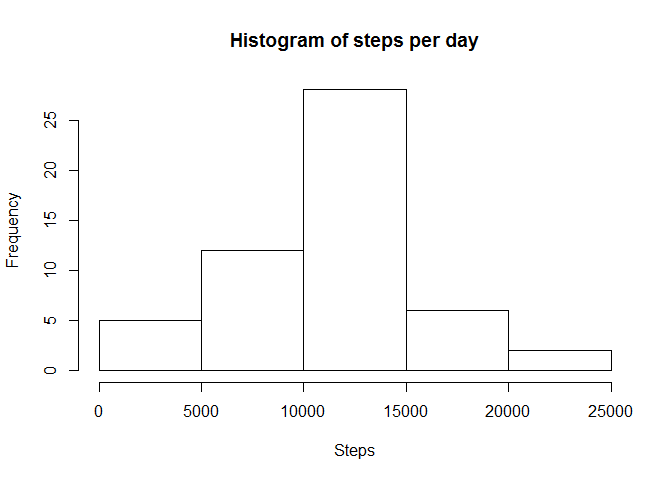
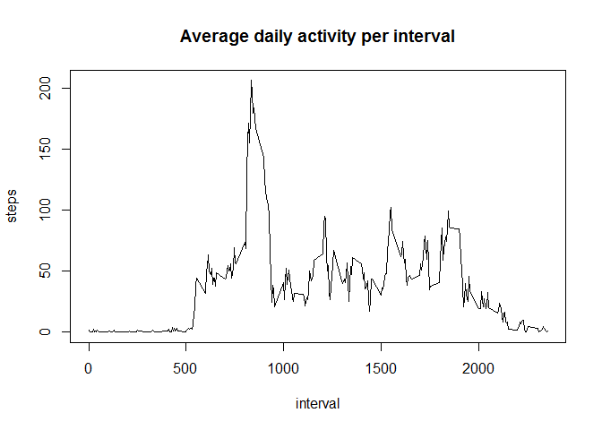
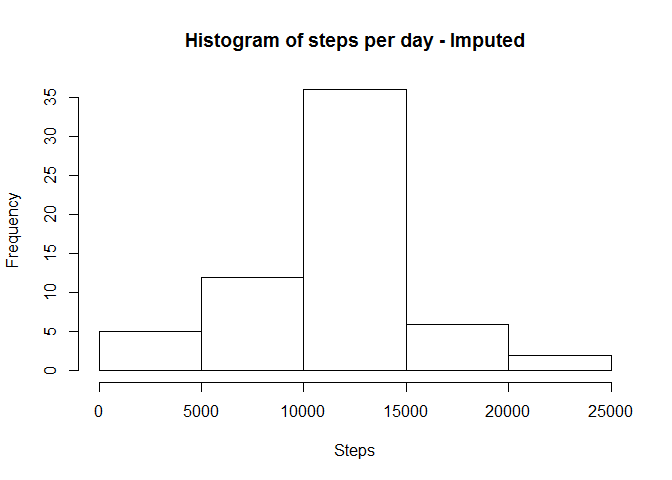
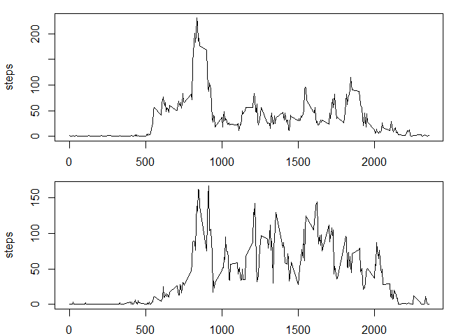

# Reproducible Research: Peer Assessment 1


## Loading and preprocessing the data

First we set the working directory and load any packages that we will be using. We use 'require' instead of 'library' so R doesn't reload the package every time the code is run. 

```r
setwd('C:\\R\\Coursera\\5_ReproducibleResearch\\Week1Project\\RepData_PeerAssessment1')
library(dplyr)
```

```
## 
## Attaching package: 'dplyr'
```

```
## The following objects are masked from 'package:stats':
## 
##     filter, lag
```

```
## The following objects are masked from 'package:base':
## 
##     intersect, setdiff, setequal, union
```

Next, we load the data and create a dataset without any missing values in the column **steps**.

```r
dat <- read.csv("activity.csv")
datnomiss <- subset(dat, !is.na(steps))
```

## What is mean total number of steps taken per day?

We sum the steps for each day using the *aggregate* function, make a plot and calculate the mean and median number of steps per day.


```r
# 1. Calculate the total number of steps taken per day
dat_agg <- aggregate(steps ~ date, data=datnomiss, FUN=sum)

# 2. Make a histogram of the total number of steps taken each day
hist(dat_agg$steps, xlab="Steps", main="Histogram of steps per day")
```



```r
# 3. Calculate and report the mean and median of the total number of steps taken per day
steps_mean <- mean(dat_agg$steps)
steps_median <- median(dat_agg$steps)

print(paste0("Mean number of steps per day: ", steps_mean))
```

```
## [1] "Mean number of steps per day: 10766.1886792453"
```

```r
print(paste0("Median number of steps per day: ", steps_median))
```

```
## [1] "Median number of steps per day: 10765"
```

## What is the average daily activity pattern?

We calculate the mean of steps per 5-minute interval and find the interval that has the highest number of steps on average. From our data, the interval 8:35-8:40 has the most steps. Presumably because the subject is walking to work.


```r
# 1. Make a time series plot 
dat_agg_day <- aggregate(steps ~ interval, data=datnomiss, FUN=mean)
plot(dat_agg_day, type="l", main="Average daily activity per interval")
```



```r
# 2. Which 5-minute interval contains the maximum number of steps?
maxinterval <- dat_agg_day[dat_agg_day$steps == max(dat_agg_day$steps),]
print(paste0("The interval containing most steps on average is: ", maxinterval$interval))
```

```
## [1] "The interval containing most steps on average is: 835"
```


## Imputing missing values

Next step is to calculate the number of missing steps and impute the missing values. The strategy chosen is simply to fill in any missing values with the total mean for that interval - as was calculated earlier. See comments for more details.


```r
# Total number of missing values in the dataset (i.e. the total number of rows with NAs)
num_miss <- sum(is.na(dat$steps))
print(paste0("Number of missing rows: ", num_miss))
```

```
## [1] "Number of missing rows: 2304"
```

```r
#Devise a strategy for filling in all of the missing values in the dataset.
# - If we have a NA-value, we replace it with the mean value for that interval.
# - We assume that the activity throughout the day is stable.


#Create a new dataset with the missing data filled in.
# - Seperate missing and non-missing data. For the missing data,
# - we join in the missing value from the average data: data_agg_day.
# - Then we do a cbind to create a full dataset.
data_nomissing <- subset(dat, !is.na(steps))
data_missing <- subset(dat, is.na(steps))

# - Remove column with NA
data_missing <- select(data_missing, -steps)

data_imputed <- left_join(data_missing, dat_agg_day, by="interval")

# - Creating a full dataset and sorting it properly
datim <- rbind(data_nomissing, data_imputed)
datim <- arrange(datim, date, interval)


# Make a histogram of the total number of steps taken each day
# 1. Calculate the total number of steps taken per day
datim_agg <- aggregate(steps ~ date, data=datim, FUN=sum)
```

When comparing the imputed dataset to the original dataset, there are a few minor differences, but overall there are no important differences in the data. In this sense we can say that the imputation was successful.


```r
# 2. Make a histogram of the total number of steps taken each day
hist(datim_agg$steps, xlab="Steps", main="Histogram of steps per day - Imputed")
```



```r
# 3. Calculate and report the mean and median of the total number of steps taken per day
steps_mean2 <- mean(datim_agg$steps)
steps_median2 <- median(datim_agg$steps)

# Mean and median number of steps per day
print(paste0("Mean number of steps per day (imputed): ", steps_mean2))
```

```
## [1] "Mean number of steps per day (imputed): 10766.1886792453"
```

```r
print(paste0("Median number of steps per day (imputed): ", steps_median2))
```

```
## [1] "Median number of steps per day (imputed): 10766.1886792453"
```

```r
# Total number of steps per day
print(datim_agg)
```

```
##          date    steps
## 1  2012-10-01 10766.19
## 2  2012-10-02   126.00
## 3  2012-10-03 11352.00
## 4  2012-10-04 12116.00
## 5  2012-10-05 13294.00
## 6  2012-10-06 15420.00
## 7  2012-10-07 11015.00
## 8  2012-10-08 10766.19
## 9  2012-10-09 12811.00
## 10 2012-10-10  9900.00
## 11 2012-10-11 10304.00
## 12 2012-10-12 17382.00
## 13 2012-10-13 12426.00
## 14 2012-10-14 15098.00
## 15 2012-10-15 10139.00
## 16 2012-10-16 15084.00
## 17 2012-10-17 13452.00
## 18 2012-10-18 10056.00
## 19 2012-10-19 11829.00
## 20 2012-10-20 10395.00
## 21 2012-10-21  8821.00
## 22 2012-10-22 13460.00
## 23 2012-10-23  8918.00
## 24 2012-10-24  8355.00
## 25 2012-10-25  2492.00
## 26 2012-10-26  6778.00
## 27 2012-10-27 10119.00
## 28 2012-10-28 11458.00
## 29 2012-10-29  5018.00
## 30 2012-10-30  9819.00
## 31 2012-10-31 15414.00
## 32 2012-11-01 10766.19
## 33 2012-11-02 10600.00
## 34 2012-11-03 10571.00
## 35 2012-11-04 10766.19
## 36 2012-11-05 10439.00
## 37 2012-11-06  8334.00
## 38 2012-11-07 12883.00
## 39 2012-11-08  3219.00
## 40 2012-11-09 10766.19
## 41 2012-11-10 10766.19
## 42 2012-11-11 12608.00
## 43 2012-11-12 10765.00
## 44 2012-11-13  7336.00
## 45 2012-11-14 10766.19
## 46 2012-11-15    41.00
## 47 2012-11-16  5441.00
## 48 2012-11-17 14339.00
## 49 2012-11-18 15110.00
## 50 2012-11-19  8841.00
## 51 2012-11-20  4472.00
## 52 2012-11-21 12787.00
## 53 2012-11-22 20427.00
## 54 2012-11-23 21194.00
## 55 2012-11-24 14478.00
## 56 2012-11-25 11834.00
## 57 2012-11-26 11162.00
## 58 2012-11-27 13646.00
## 59 2012-11-28 10183.00
## 60 2012-11-29  7047.00
## 61 2012-11-30 10766.19
```

The mean and median steps are very close to the numbers we found earlier.


## Are there differences in activity patterns between weekdays and weekends?

Creating a faactor variable based on the weekdays. (Using a Norwegian locale, hence the Norwegian names.)


```r
# Create a new factor variable in the dataset with two levels - "weekday" and "weekend"
datim2 <- mutate(datim, day = weekdays(as.Date(date)))
datim2$daytype <- rep(NA, nrow(datim2))
datim2[datim2$day %in% c("lørdag","søndag"), ][, "daytype"] <- "weekend"
datim2[is.na(datim2$daytype), ][, "daytype"] <- "weekday"
datim2$daytype <- as.factor(datim2$daytype)
datim2 <- select(datim2, -day)

# Make a plot comparing averaged intervals for all weekdays/weekenddays
datim2_wd <- datim2[datim2$daytype == "weekday",]
datim2_we <- datim2[datim2$daytype == "weekend",]

datim2_agg_wd <- aggregate(steps ~ interval, data=datim2_wd, FUN=mean)
datim2_agg_we <- aggregate(steps ~ interval, data=datim2_we, FUN=mean)

par(mfrow=c(2,1),mar=c(2,4.1,1,2))
plot(datim2_agg_wd, type="l")
plot(datim2_agg_we, type="l")
```



There main difference between weekdays and weekends is that the number of steps is more more evenly spread out over the whole day. 


